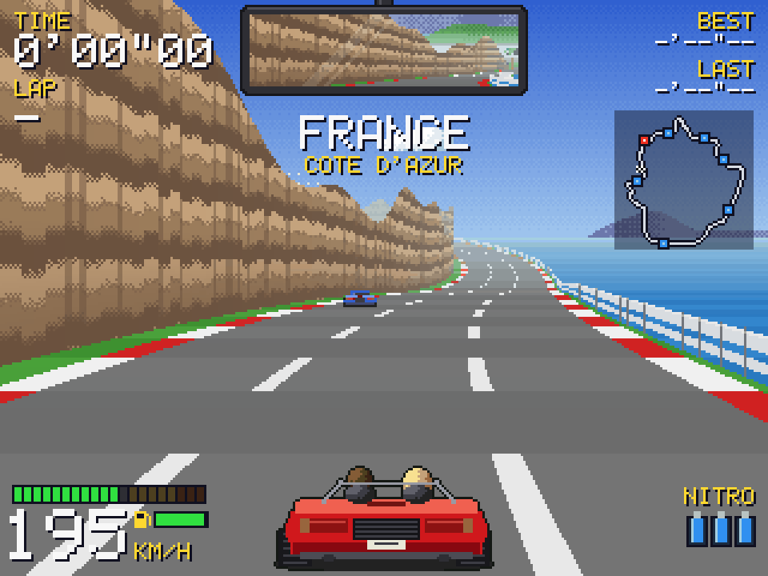
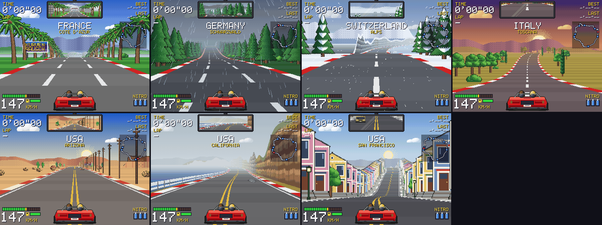

# Kurvenrausch

Classic pseudo-3D bitmap racer in the spirit of *OutRun*, *Lotus Esprit Turbo
Challenge* and *Pole Position*: a lap through Europe and the USA with weather,
cliff roads, traffic, and a synthesised engine.

Written in **C++17** with **SDL2**. Everything is drawn in software, scanline by
scanline, into a 320x240 framebuffer that is scaled up with nearest-neighbour
filtering for chunky pixels. All art is generated procedurally as pixel art at
startup and all sound is synthesised on the fly: there are no asset files.
Packaged with a **Nix flake**.



One lap takes you around the world through sixteen zones, each with its own country, scenery,
weather and road markings, fading smoothly into one another:



## Features

- Segment-based pseudo-3D road: perspective projection (`scale = depth / z`),
  curves by accumulated lateral offset, hills and crests with correct
  occlusion, alternating rumble strips and grass bands, lane markings, a
  chequered start line, and distance fog
- **Sixteen zones** with blended looks: the Cote d'Azur (palms, sunny),
  England (narrow lanes between hedgerows and stone walls, drizzle), the
  Netherlands (dead flat: windmills, tulip fields, a canal), the Black Forest
  (firs in the rain), the Alps (snowfall, chalets, a pass), Tuscany (cypress
  avenues at sunset), Egypt (date palms along the Nile, pyramids), Kenya
  (acacias, giraffes and Kilimanjaro under an orange sky), India (banyans,
  temples, cows, haze), Korea (red maples and hanok gates in autumn), Japan
  (cherry blossom, shrine gates, a snow-capped volcano), the Australian
  outback (red earth, gum trees, Uluru), Arizona (desert, cacti, mesas,
  telephone poles), the California coast (sandstone cliff and sea in thick
  fog), San Francisco (steep streets between Victorian row houses) and the
  Amazon rainforest in a downpour; a banner announces each country. Roads
  differ in width as well as in markings
- **Cliffs and guard rails** along the road: strata-textured rock walls that
  rise and fall with the terrain, rails above the sea or a valley; both are
  solid, the car scrapes along them and throws sparks
- **Weather**: rain streaks, swaying snowflakes, fog, a sun, tinted clouds and
  haze; wet and icy roads reduce grip. Driving, the rain and snow stream out
  of the vanishing point in ever longer streaks the faster you go
- **Wet spots**: puddles on the road in the rainy and snowy zones; hit one
  fast and the car aquaplanes, throwing up spray. Rarely, an **oil slick**:
  hardly any grip at all
- Roadside scenery as scaled, fogged pixel-art sprites; objects behind a crest
  peek over it
- Parallax backdrop: copper-banded sky, drifting clouds, mountains and hills
  scrolling at different rates through bends
- Road markings per region: dashed white lines in Europe, double yellow centre
  line and white edge lines in the USA
- AI traffic of cars, vans, slow trucks and the rare rival sports car that
  races you when you come close; it changes lanes to pass, blinking its
  indicators, or brakes behind slower vehicles (and you) when it can't;
  rear-ending one slows you down
- Working brake lights, on your car and on the traffic; tyres that roll and
  flicker at speed
- **Horn**: cars ahead in your line signal and pull over to let you through
- **Close passes**: squeeze past a car and your driver (or passenger, on the
  right) waves, with a whoosh and a little boost beyond top speed
- **Nitro**: three canisters per lap, each a three second burn with flames
  from the exhausts, more thrust and a higher top speed
- **Rear-view mirror** at the top of the screen: the road behind, drawn by the
  same renderer looking back, with the fronts of the cars you have passed
- **Forks**: the road splits OutRun-style into two routes that join again
  later, in smooth S-bends, the other road in view alongside; signposted and
  named on screen: the Autobahn or the Landstrasse in
  Germany, Route 66 or the Canyon Road in Arizona; keep to the side of the
  road you want to take
- **Jumps**: San Francisco's streets climb and drop at up to 55% grade, flat
  at every crossing; take a crest fast and the car flies, landing with a thump
- Arcade handling with analog steering and pedals; centrifugal force, off-road
  slowdown; hit something off the road at speed and the car **tumbles** over
  in a cloud of dust and debris before it is put back on the road
- **Fuel and gas stations**: the tank drains with the engine's load (about a
  lap and a quarter at full throttle); every zone has a gas station with a
  forecourt to pull onto, where the tank fills up while you stand by the
  pumps. Run dry and the engine sputters and dies; stranded, the driver pours
  in a spare can after a few seconds
- **Car dealers**: stop at one and choose from four cars, the Spider, the GT
  Coupe, the Hot Hatch and the Muscle car, each with its own top speed,
  acceleration and grip
- **Dirt and car washes**: puddles splash the car with mud, crashes add more,
  oil slicks leave black spots; stop at one of the car washes in England,
  Kenya and the outback to have it washed clean
- **Mini map** of the lap with your position, the start line, the gas
  stations, the car dealers and the car washes
- **Synthesised sound**: a six-cylinder engine with exhaust pulses ringing a
  pipe and a body resonance for the bass, building with the revs, surging as
  the throttle opens and crackling on the overrun; gear changes, tyre squeal,
  gravel, wind, rain, splashes, barrier scraping and crashes; `M` mutes
- Keyboard and **gamepad** (any controller SDL knows, hot-pluggable, with
  rumble)
- HUD in a bitmap font: lap time, lap counter, best and last lap, speedometer,
  rev counter, GO! / LAP / NEW RECORD banners
- Fixed 60 Hz simulation, independent of the frame rate

## Build

```bash
# Nix: reproducible shell, or build the package
nix develop
nix build
./result/bin/kurvenrausch

# or with CMake and SDL2 installed
cmake -B build
cmake --build build
./build/kurvenrausch
```

### Install

```bash
cmake -B build -DCMAKE_INSTALL_PREFIX=/usr/local
cmake --build build
sudo cmake --install build
```

This installs the game with its desktop integration: the program, a desktop
entry and AppStream metadata (`io.github.grumbel.kurvenrausch`), icons in the
hicolor theme (PNGs from 16 to 256 pixels and an SVG) and the man page,
`man 6 kurvenrausch`. The Nix package (`nix build`) contains the same. The
icon is the game's own pixel art, also its window icon;
`tools/make_icons.py` regenerates the files from it.

## Controls

| Keyboard         | Gamepad                  | Action             |
|------------------|--------------------------|--------------------|
| ↑ / W            | Right trigger, A         | Accelerate         |
| ↓ / S            | Left trigger, B          | Brake              |
| ← → / A D        | Left stick, D-pad        | Steer              |
| H                | X, left shoulder         | Horn               |
| Space            | Y, right shoulder        | Nitro              |
| P                | Start                    | Pause menu: resume, restart, start in a chosen country, quit |
| R                |                          | Restart            |
| M                |                          | Mute sound         |
| F11 / Alt+Enter  |                          | Toggle fullscreen  |
| Esc              |                          | Quit (in the pause menu: back to the race) |

Any controller SDL knows (Xbox, PlayStation, Switch Pro, most generic pads) works
and can be plugged in at any time; analog sticks and triggers steer and
accelerate proportionally, and the pad rumbles on crashes, scraping, close
passes, nitro and when you leave the road. Additional mappings can be supplied through SDL's
`SDL_GAMECONTROLLERCONFIG` environment variable. Keyboard and gamepad can be
used together.

## Tests

```bash
cmake -B build && cmake --build build
ctest --test-dir build --output-on-failure
```

The unit tests cover the input mapping, zone blending, the route's invariants,
cliffs and barriers, weather, lane logic, lap detection and the sound synthesis
(which is rendered offline and checked by its spectrum). Further tests check
that the man page documents every option, and run `desktop-file-validate`,
`appstreamcli validate` and `mandoc -T lint` where they are installed (the
Nix dev shell has them).

## Headless mode

The game can render without a window, which is how the screenshots above are
made and how rendering changes are checked without a display:

```bash
./build/kurvenrausch --print-zones                       # list the zones
./build/kurvenrausch --screenshot shot.bmp --zone 3 --frames 150
./build/kurvenrausch --screenshot shot.bmp --position 240000 --frames 600
./build/kurvenrausch --screenshot shot.bmp --frames 9000 --wav lap.wav
./build/kurvenrausch --screenshot shot.bmp --steer 1     # hold the steering
./build/kurvenrausch --screenshot shot.bmp --frames 600 --nitro 540   # nitro at step 540
./build/kurvenrausch --screenshot shot.bmp --frames 3600 --horn       # honk all the way
./build/kurvenrausch --screenshot shot.bmp --frames 2400 --fuel 0.3   # low fuel: pulls in
./build/kurvenrausch --screenshot shot.bmp --frames 640 --steer -1 --steer-from 600  # crash
./build/kurvenrausch --screenshot shot.bmp --zone 1 --frames 300 --car 2   # another car
./build/kurvenrausch --screenshot shot.bmp --zone 5 --frames 1400 --dealer # visit a dealer
```

It simulates the given number of 60 Hz steps with a simple autopilot that also
pulls in at gas stations when low on fuel (or a held steering angle), renders one frame and writes it as a BMP; `--wav` also writes
the sound of the run. `tools/make_screenshots.py` (needs Pillow) regenerates
the README images.

## Architecture

```
include/
  types.hpp        Color (ARGB8888), blending, dithering, hash noise
  ecs.hpp          minimal Entity-Component-System
  components.hpp   Transform, Velocity, Player, Traffic, Camera
  track.hpp        Track, Segment, Zone, RoadTheme (the blendable look),
                   edges (rails, cliffs), scenery kinds, the route builder
  road.hpp         road projection and rendering (ahead or, for the mirror,
                   behind), cliffs, road sprites
  background.hpp   parallax sky, sun, clouds, mountains, hills
  weather.hpp      rain and snow particles
  sprites.hpp      procedural pixel-art sprite sheet
  bitmap.hpp       Bitmap and paint helpers for generating sprites
  font.hpp         5x7 bitmap font
  hud.hpp          HUD drawing
  framebuffer.hpp  software framebuffer: clipping, trapezoids, scaled blits
  display.hpp      SDL window presentation, BMP export
  input.hpp        keyboard and gamepad input (analog), rumble
  drivetrain.hpp   gears and revs, shared by the HUD and the sound
  vehicles.hpp     the kinds of traffic: sizes, speeds, shares, the rival
  driving.hpp      nitro, fuel, overspeed, the pass boost, yielding to the
                   horn, following traffic, the crash animation
  synth.hpp        sound synthesis (pure DSP, no SDL), WAV export
  audio.hpp        SDL audio device playing the synth
  game.hpp         game loop, physics, traffic, lap timing
src/               implementations
tests/             unit tests (CTest)
data/              desktop entry, AppStream metadata, man page, icons
tools/             screenshot and icon generators
docs/              README images
LICENSES/          licence text (REUSE)
```

### Classic techniques used

1. **Segmented road**: the track is a looping array of short segments, each
   with a curve value and heights at both edges, built from sections that
   ease into and out of bends and hills.
2. **Perspective scale**: `scale = camera_depth / z`; screen x, y and road
   width follow from it.
3. **Curve accumulation**: walking the segments near to far,
   `x += dx; dx += curve`, starting with the part of the current segment
   already passed so bends move smoothly.
4. **Hill occlusion**: road is drawn near to far while tracking the highest
   row drawn so far (`max_y`); segments behind a crest are skipped or
   clipped. Sprites, cliffs and rails are drawn far to near, clipped against
   the road in front of them.
5. **Scanline fill**: road, rumble strips and lanes are trapezoids filled as
   horizontal spans with sub-pixel edges; cliffs are filled column by column.
6. **Billboard sprites**: scenery and cars scaled with the same projection,
   blended into the fog with distance.
7. **Looks**: every segment carries a precomputed blend of its zone's theme
   and its neighbours', so sky, fog, weather, markings and handling change
   smoothly along the track.

## License

Copyright 2026 Ingo Ruhnke <grumbel@gmail.com>

Kurvenrausch is free software: you can redistribute it and/or modify it under
the terms of the GNU General Public License as published by the Free Software
Foundation, either version 3 of the License, or (at your option) any later
version. See [`LICENSES/GPL-3.0-or-later.txt`](LICENSES/GPL-3.0-or-later.txt).
The AppStream metadata file alone is under CC0-1.0, as AppStream requires a
permissive licence for metadata.

The repository follows the [REUSE](https://reuse.software/) specification:
`reuse lint` passes.

## Credits

Inspired by Louis Gorenfeld's ["Lou's Pseudo 3D Page"](http://www.extentofthejam.com/pseudo/)
and Jake Gordon's [JavaScript Racer tutorial](https://codeincomplete.com/articles/javascript-racer/). The code itself is original.
